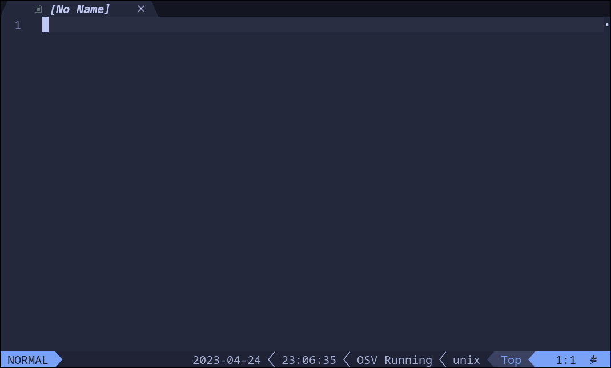

# lualine-osv

[OSV](https://github.com/jbyuki/one-small-step-for-vimkind) extension for [lualine.nvim](https://github.com/nvim-lualine/lualine.nvim)

## Screenshot



## Use

Add the component osv to one of your lualine sections.

```lua
require'lualine'.setup {
	...
	sections = {
		lualine_x = {
			'osv',
			...
		}
	}
}
```

## Installation

### [lazy.nvim](https://github.com/folke/lazy.nvim)

```lua
{ 'luozhiya/lualine-osv' }
```

## Thanks

-- https://github.com/archibate/lualine-time
